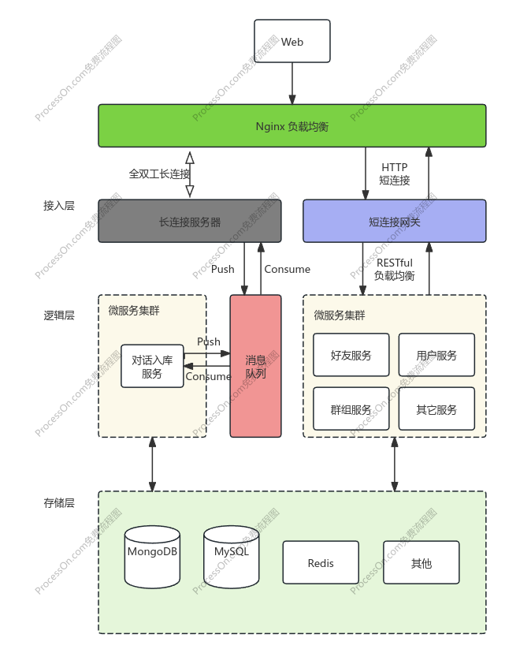

# cowIM

个人绞尽脑汁设计的即时通讯系统

### 架构图

### 目前实现与进度
#### 底层及架构
- [x] 自定义应用层协议
  
- HTTP 网关 // 计划替换成品API网关
- [x] 反向代理
- [x] 鉴权
- [ ] 用户黑名单
- [x] CORS
- [ ] 网络隔离
  
- Websocket Server
- [x] 鉴权
- [x] 客户端连接信息保存
- [ ] 网络隔离

#### 业务
- [x] 注册
- [x] 登陆
- [ ] 好友列表获取
- [ ] 消息记录
- [ ] 群聊列表获取
- [ ] 最近会话列表
- [x] 单聊
- [ ] 群聊

#### 参考与启发
- https://www.bilibili.com/video/BV1KM411S7WT
- http://www.52im.net/thread-4257-1-1.html
- https://space.bilibili.com/30625295/channel/collectiondetail?sid=3179321
- https://www.bilibili.com/video/BV1rU4y17769
- https://github.com/zeromicro/zero-examples/tree/main/chat
- https://www.bilibili.com/video/BV1se4ReWEHL
- http://www.52im.net/thread-1616-1-1.html
- https://xie.infoq.cn/article/19e95a78e2f5389588debfb1c