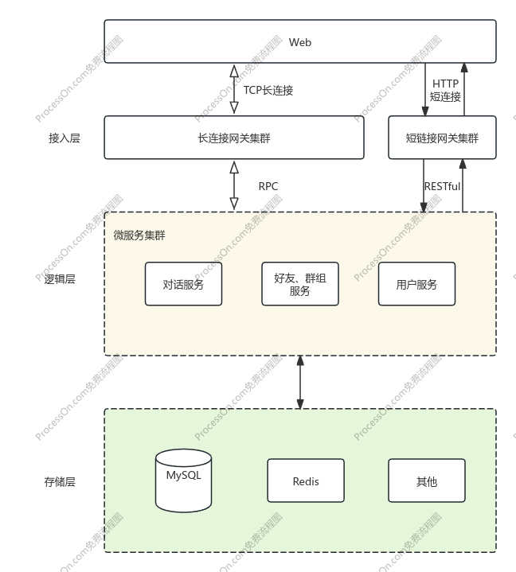

# cowIM

个人绞尽脑汁设计的即时通讯系统

### 架构图

### 目前实现与进度
#### 底层及架构
- [x] 自定义应用层协议
  
- HTTP 网关
- [x] 反向代理
- [x] 鉴权
- [ ] 用户黑名单
- [x] CORS
- [ ] 网络隔离
  
- TCP 网关
- [x] 反向代理
- [ ] 鉴权
- [ ] 客户端连接信息保存
- [ ] 网络隔离

#### 业务
- [x] 注册
- [x] 登陆
- [ ] 好友列表获取
- [ ] 消息记录
- [ ] 群聊列表获取
- [ ] 最近会话列表
- [ ] 单聊
- [ ] 群聊